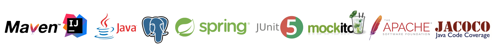

# job4j_cars
Проект "АвтоМаг"

[![github actions][actions-image]][actions-url]
[![coverage][codecov-image]][codecov-url]

### Используемые технологии

Веб приложение по продаже машин на языке Java с Hibernate.
Возможности сайта:
- На сайте находятся объявления.
- В объявлении: описание, марка машины, тип кузова, фото.
- Объявление имеет статус продано или нет.

### Архитектура приложения трехслойное
- Слой контроллеры
- Слой сервисы
- Слой работы с БД

### Требуемое окружение
- JDK 17
- Apache Maven 3.8.5
- PostgreSQL 13
- Браузер

### Подготовка к запуску приложения
- Создать БД cars хост `jdbc:postgresql://localhost:5432/cars`
- Собрать jar с приложением, выполнив команду `mvn install`
- Запустить приложение, выполнив команду: `java -jar job4j_cars`
- Перейти в браузере по ссылке `http://localhost:8080/index`

[actions-image]: https://img.shields.io/endpoint?url=https://github-actions-badge-u3jn4tfpocch.runkit.sh/kamikhaylov/job4j_cars
[actions-url]: https://github.com/kamikhaylov/job4j_cars/actions
[codecov-image]: https://codecov.io/gh/job4j_cars/actions/branch/main/graphs/badge.svg
[codecov-url]: https://app.codecov.io/gh/kamikhaylov/job4j_cars