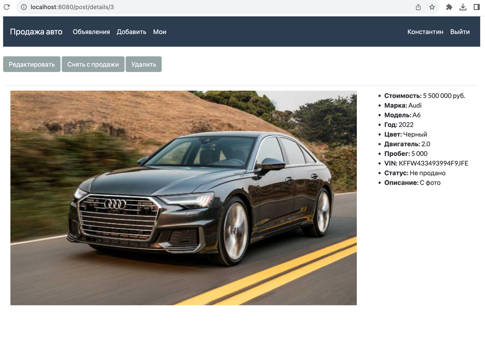

# job4j_cars
Проект "Продажа автомобилей"

[![github actions][actions-image]][actions-url]
[![coverage][codecov-image]][codecov-url]

### Используемые технологии

Веб приложение по продаже автомобилей на языке Java с Hibernate.
Возможности сайта:
- При входе на сайт гостевому пользователю доступен просмотр объявлений с фильтрами 
  и просмотр детальной информации по объявлению.
- В объявлении: фото, описание, марка, модель, пробег, стоимость, цвет и другие атрибуты.
- После регистрации и авторизации пользователя появляется возможность создавать новые объявления.
- Свои объявления есть возможность редактировать, удалять, снимать с продажи, возвращать в продажу.
- Если при создании объявления не выбрано фото, то будет выведено изображение по умолчанию.

### Архитектура приложения трехслойная
- Слой контроллеры
- Слой сервисы
- Слой работы с БД

### Требуемое окружение
- JDK 17
- Apache Maven 3.8.5
- PostgreSQL 13
- Браузер

### Подготовка к запуску приложения
- Создать БД cars хост `jdbc:postgresql://localhost:5432/cars`
- Собрать jar с приложением, выполнив команду `mvn install`
- Запустить приложение, выполнив команду: `java -jar job4j_cars`
- Перейти в браузере по ссылке `http://localhost:8080/posts/list`

### Таблицы PostgreSQL DB
Таблицы базы данных написаны с помощью Liquibase. Схема БД:

### Главная страница, список всех объявлений
Доступные фильтры:
- Все (показывает автомобили на продаже)
- За день (поданные за текущий день)
- С пробегом
- Новые
- Включая проданные

### Страница добавления нового объявления

### Страница с объявлениями авторизованного пользователя

### Страница с детальной информацией объявления
Для своего объявления доступны:
- Редактирование объявления
- Если авто в статусе "Не продано", доступна кнопка "Снять с продажи"
- Если авто в статусе "Продано", доступна кнопка "Вернуть на продажу"
- Удаление объявления

Для чужого объявления действия редактирования не доступны.

### Страница редактирования объявления

### Главная страница при гостевом входе

### Страница регистрации нового пользователя

### Ошибка при регистрации нового пользователя

### Успешная регистрация нового пользователя

### Страница авторизации пользователя

### Ошибка при авторизации пользователя

### Контакты
kanmikhaylov@gmail.com

[actions-image]: https://github.com/kamikhaylov/job4j_cars/actions/workflows/maven.yml/badge.svg
[actions-url]: https://github.com/kamikhaylov/job4j_cars/actions/workflows/maven.yml
[codecov-image]: https://codecov.io/gh/kamikhaylov/job4j_cars/graph/badge.svg?token=88F9IMOKGF
[codecov-url]: https://codecov.io/gh/kamikhaylov/job4j_cars